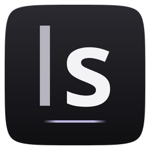
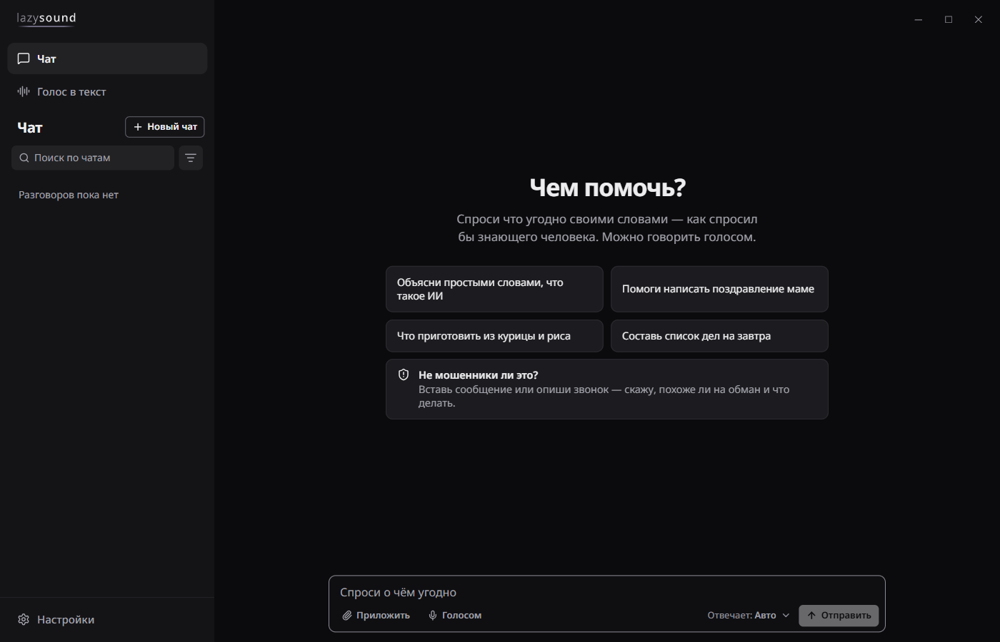
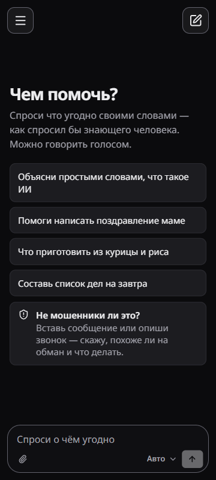

  

<h1 align="center">LazySound</h1>

  Чат с нейросетью и голос в текст. 
  Для компьютера с Windows и телефона с Android.

  
  &nbsp;
  

  

  

Сделано для людей, которые в компьютерах не разбираются: открыл и спросил своими словами.
Кнопки наверху всегда ведут на последнюю версию. Все версии лежат в разделе
[Releases](https://github.com/MatthewButovskiy/LazySound-releases/releases).

## Что умеет

**Чат.** Спрашиваешь, как спросил бы знающего человека: текстом или голосом, можно приложить фото.
Разговоры хранятся на твоём устройстве, по ним есть поиск.

**«Не мошенники ли это?»** Вставь сообщение или опиши звонок. Приложение скажет, похоже ли это на
обман и что делать.

**Голос в текст**, только на Windows. Перетащи запись или видео и получи текст. Русскую речь
распознаёт бесплатно и без интернета: модель скачивается одной кнопкой, 222 МБ.

**Диктовка в любом окне**, тоже только на Windows. Зажал клавишу, сказал, и текст появился там, где
стоит курсор.

На телефоне пока только чат.

 

## Как поставить на Windows

Нужна Windows 10 или 11.

1. Нажми «Скачать для Windows» наверху страницы. Скачается файл `LazySound_x64-setup.exe`.
2. Открой его. Если появится синее окно «Система Windows защитила ваш компьютер», нажми
   «Подробнее», потом «Выполнить в любом случае». Так Windows встречает программы, у которых нет
   платной подписи издателя.
3. Пройди установку до конца. Галочка «Добавить ярлык на рабочий стол» на последней странице уже
   стоит.

## Как поставить на Android

Нужен Android 7 или новее.

1. Открой эту страницу на телефоне и нажми «Скачать для Android». Скачается файл
   `LazySound_android-aarch64.apk`.
2. Открой его из уведомления о загрузке или из папки «Загрузки».
3. Телефон спросит, можно ли ставить приложения из этого источника. Разреши и вернись назад.
4. Нажми «Установить». Если телефон предупредит, что разработчик ему неизвестен, выбери «Всё равно
   установить».

## Первый запуск

Чат отвечает через платный сервис, поэтому приложение сначала спросит, как входить.

**По приглашению.** Его присылает тот, кто уже пользуется приложением и платит за сервис. Вставь
приглашение на первом экране и нажми «Начать». Цен ты не увидишь, ключи вставлять не придётся.

**Со своим ключом.** Подойдёт ключ AITunnel, OpenAI, Claude, Gemini, DeepSeek и других сервисов.
Приложение само определит, от какого он сервиса, и покажет, что этот ключ открывает.

Распознавание русской речи на компьютере работает и без входа.

## Как обновлять

Заново скачивать ничего не надо. При запуске приложение само смотрит, не вышла ли новая версия. Если
вышла, появится окно «Вышла версия» с кнопкой «Обновить».

На Windows приложение скачает обновление, закроется и откроется уже новым. На Android телефон
попросит подтвердить установку.

Разговоры и настройки остаются на месте. Если в эту минуту пишется ответ или идёт диктовка,
обновление подождёт. Проверить вручную можно в настройках, кнопка «Проверить обновления».

## Деньги и данные

Ничего платного не запускается само. Своего сервера у приложения нет: вопросы уходят только в тот
сервис, чей ключ или приглашение ты вставил, а разговоры лежат на твоём устройстве. На Windows ключ
хранится в защищённом хранилище системы, не в файлах.

## Условия

Приложение бесплатное и отдаётся как есть, без гарантий. Код закрыт. В этом репозитории лежат только
установщики и файлы обновлений.

Если что-то не работает, напиши тому, кто дал тебе приложение.
